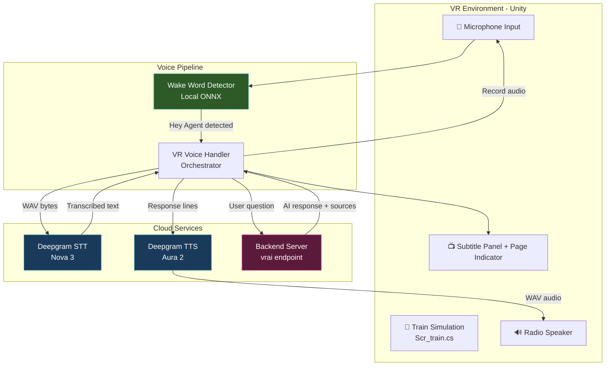
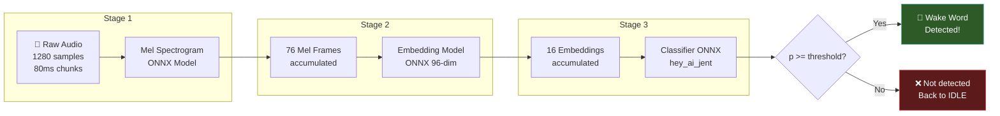
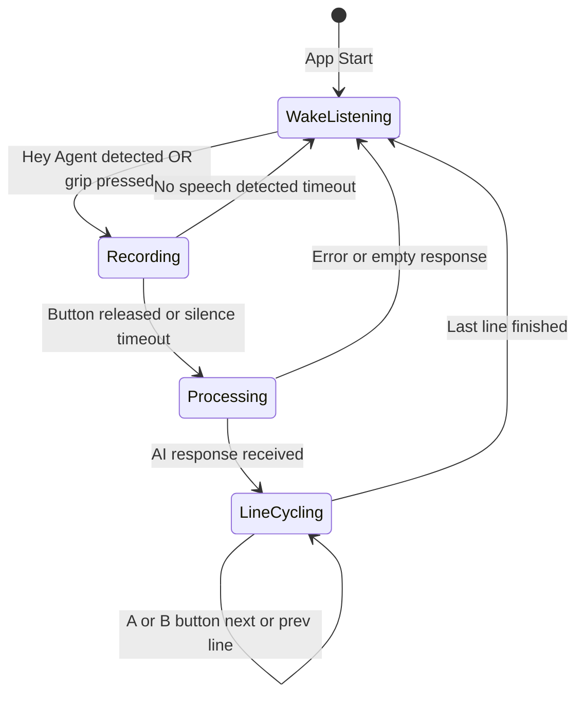
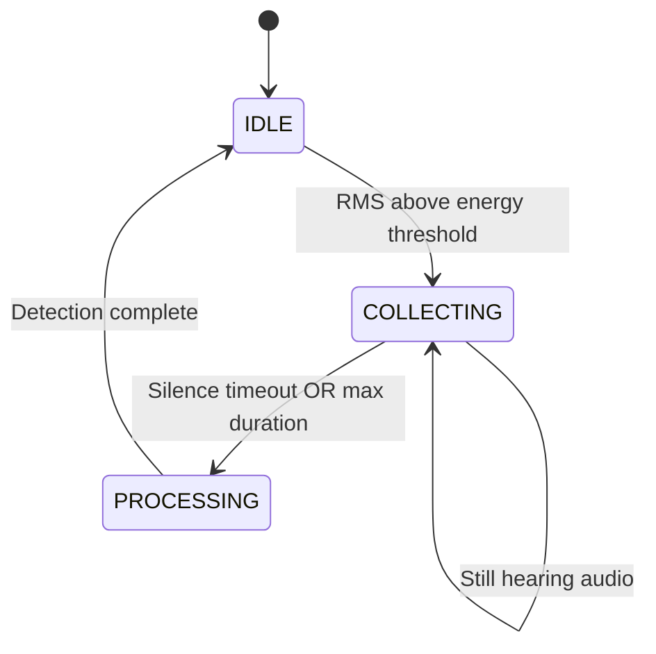

# 🚂 Unity XR Train Simulator

A **VR railroad safety training simulator** built with Unity and the XR Interaction Toolkit, designed for Meta Quest headsets. Features an AI-powered voice assistant with hands-free wake-word detection, speech-to-text, text-to-speech, and intelligent training content delivery — all within an immersive railroad crossing environment.

---

## 📋 Table of Contents

- [Features](#-features)
- [Architecture](#-architecture)
- [Prerequisites](#-prerequisites)
- [Getting Started](#-getting-started)
- [API Keys Setup](#-api-keys-setup)
- [Project Structure](#-project-structure)
- [Script Reference](#-script-reference)
- [Building & Deploying](#-building--deploying)
- [Usage Guide](#-usage-guide)
- [Troubleshooting](#-troubleshooting)
- [License](#-license)

---

## ✨ Features

| Feature | Description |
|---------|-------------|
| **VR Railroad Crossing** | Realistic train simulation with configurable speed, timing, and hazard indicators |
| **AI Voice Assistant** | Ask questions about railroad safety and get spoken AI responses |
| **Hands-Free Wake Word** | Say **"Hey Agent"** to activate the assistant — no buttons needed |
| **On-Device Wake Detection** | Wake word runs entirely locally via ONNX models (zero API calls) |
| **Deepgram STT/TTS** | Cloud-based speech-to-text and text-to-speech via Deepgram Nova 3 & Aura 2 |
| **Bi-Directional Navigation** | Skip forward/backward through AI response lines with controller buttons |
| **Audio Caching** | TTS audio is prefetched in parallel for instant playback on navigation |
| **Meta Quest Support** | Optimized for Quest 2, Quest 3, Quest 3S, and Quest Pro |

---

## 🏗️ Architecture

### System Overview



### Wake Word Detection Pipeline (Fully Local)



### Voice Handler State Machine



### Wake Word Detector States



---

## 📦 Prerequisites

| Requirement | Version |
|-------------|---------|
| **Unity Editor** | 6000.x (Unity 6) |
| **XR Interaction Toolkit** | 3.3.1 |
| **Unity Inference Engine** (Sentis) | 2.6.1 |
| **OpenXR Plugin** | 1.16.1 |
| **TextMeshPro** | Included |
| **Target Platform** | Android (Meta Quest) |
| **Android SDK** | API Level 32+ |
| **Scripting Backend** | IL2CPP |

---

## 🚀 Getting Started

### 1. Clone the Repository

```bash
git clone https://github.com/<your-username>/UnityXRTTrainSimulator.git
```

### 2. Open in Unity

1. Open **Unity Hub**
2. Click **"Add project from disk"**
3. Navigate to the cloned `UnityXRTTrainSimulator` folder and select it
4. Ensure you're using **Unity 6000.x** — if prompted, install the correct editor version
5. Unity will import all packages automatically (this may take several minutes on first open)

### 3. Install Required Packages (if missing)

Open **Window > Package Manager** and ensure these are installed:

- `XR Interaction Toolkit` (3.3.1)
- `Unity Inference Engine` (2.6.1) — formerly Sentis
- `OpenXR Plugin` (1.16.1)

### 4. Configure Build Settings

1. **File > Build Settings**
2. Select **Android** as the platform
3. Click **Switch Platform** (if not already on Android)
4. In **Player Settings > Other Settings**:
   - Set **Minimum API Level** to **32**
   - Set **Scripting Backend** to **IL2CPP**
   - Set **Target Architectures** to **ARM64**
5. In **XR Plugin Management**:
   - Enable **OpenXR** under the Android tab
   - Add **Meta Quest Touch Pro Controller Profile** as an interaction profile

---

## 🔑 API Keys Setup

This project requires **two API keys** that must be set via the **Unity Inspector** (never hardcode them in scripts).

### Required Keys

| Key | Purpose | Where to Get It |
|-----|---------|-----------------|
| **Backend API Key** | Authenticates with your `/vrai` training content server | Your backend admin panel |
| **Deepgram API Key** | Powers speech-to-text (Nova 3) and text-to-speech (Aura 2) | [console.deepgram.com](https://console.deepgram.com) |

### How to Set Keys

1. Open the scene: **Assets > Scenes > VRTrainSimulator.unity**
2. In the **Hierarchy**, find the GameObject that has the **VRVoiceHandler** component
3. In the **Inspector**, locate the **"Network Settings"** section:

```
┌─ Network Settings ─────────────────────────┐
│ Server URL:       https://your-server.com   │
│ Api Key:          <paste backend key here>  │
│ Deepgram Api Key: <paste deepgram key here> │
└─────────────────────────────────────────────┘
```

4. Paste your keys into the **Api Key** and **Deepgram Api Key** fields
5. Update the **Server URL** to point to your backend server
6. **Save the scene** (`Ctrl+S`)

> **⚠️ Important:** These values are serialized into the Unity scene file. If you make the repo public, the scene file will contain your keys. For production, consider loading keys from environment variables or a config file not tracked by git.

### Getting a Deepgram API Key

1. Sign up at [console.deepgram.com](https://console.deepgram.com)
2. Create a new project
3. Go to **API Keys** > **Create Key**
4. Copy the key and paste it into the Unity Inspector

---

## 📂 Project Structure

```
UnityXRTTrainSimulator/
├── Assets/
│   ├── Models/                          # ONNX models for wake word detection
│   │   ├── melspectrogram.onnx          # Audio to Mel spectrogram (Stage 1)
│   │   ├── embedding_model.onnx         # Mel frames to 96-dim embedding (Stage 2)
│   │   ├── hey_ai_jent.onnx             # Embedding to wake word probability (Stage 3)
│   │   └── WakeWord/models_backup/      # Backup copies of ONNX models
│   │
│   ├── Scripts/                         # Core voice and AI scripts
│   │   ├── VRVoiceHandler.cs            # Main orchestrator: recording, STT, TTS, navigation
│   │   ├── WakeWordDetector.cs          # Local ONNX wake word detection pipeline
│   │   └── WavUtility.cs               # WAV encoding/decoding helper
│   │
│   ├── MyAssets/Scripts/                # Train simulation scripts
│   │   └── Scr_train.cs                # Train movement, timing, hazard indicator
│   │
│   ├── Scenes/
│   │   └── VRTrainSimulator.unity       # Main scene
│   │
│   ├── Oculus/                          # Meta Quest configuration
│   ├── Plugins/Android/                 # Android manifest (Quest VR intent filters)
│   ├── Resources/                       # OVR/Meta XR runtime settings
│   ├── Samples/                         # XR Interaction Toolkit starter assets
│   └── XR/                             # OpenXR settings and profiles
│
├── Packages/
│   └── manifest.json                    # Unity package dependencies
│
├── ProjectSettings/                     # Unity project configuration
├── .gitignore                           # Unity-optimized gitignore
└── README.md                            # This file
```

---

## 📜 Script Reference

### `VRVoiceHandler.cs` — Voice Assistant Orchestrator

The central controller that ties together recording, cloud APIs, and UI.

**Inspector Fields:**

| Field | Type | Description |
|-------|------|-------------|
| `serverUrl` | `string` | Base URL of your backend server |
| `apiKey` | `string` | Backend API key for `/vrai` endpoint authentication |
| `deepgramApiKey` | `string` | Deepgram API key for STT and TTS |
| `recordButton` | `InputActionProperty` | VR controller input to hold-to-record (grip) |
| `nextButton` | `InputActionProperty` | VR controller input to advance to next line (A button) |
| `prevButton` | `InputActionProperty` | VR controller input to go back one line (B button) |
| `subtitleDisplay` | `TextMeshProUGUI` | UI text element for displaying subtitles |
| `pageIndicator` | `TextMeshProUGUI` | UI text showing line number e.g. "2 / 5" |
| `subtitlePanel` | `GameObject` | Parent panel shown/hidden during interactions |
| `radioSpeaker` | `AudioSource` | Audio source used to play TTS audio |
| `enableWakeWord` | `bool` | Toggle hands-free "Hey Agent" activation |
| `wakeWordDetector` | `WakeWordDetector` | Reference to the wake word detector component |

**Key Methods:**

| Method | Description |
|--------|-------------|
| `ProcessVoiceQuery()` | Full pipeline: STT → Backend → split lines → TTS |
| `CallDeepgramSTT()` | Sends WAV audio to Deepgram Nova 3 for transcription |
| `CallVraiEndpoint()` | Sends transcribed text to backend `/vrai` endpoint |
| `BeginLineCycling()` | Starts paginated response playback with parallel prefetch |
| `SkipToLine()` | Jump to any line index (forward or backward) |
| `AutoRecordAfterWake()` | Hands-free recording with silence-based auto-stop |

---

### `WakeWordDetector.cs` — Local ONNX Wake Word Detection

Runs a 3-stage neural network pipeline entirely on-device. Zero API calls.

**Inspector Fields:**

| Field | Type | Description |
|-------|------|-------------|
| `melSpectrogramModelAsset` | `ModelAsset` | Drag `melspectrogram.onnx` here |
| `embeddingModelAsset` | `ModelAsset` | Drag `embedding_model.onnx` here |
| `classifierModelAsset` | `ModelAsset` | Drag `hey_ai_jent.onnx` here |
| `detectionThreshold` | `float` | Probability threshold to trigger (default: `0.5`) |
| `energyThreshold` | `float` | Minimum RMS energy to detect voice activity (default: `0.0001`) |
| `volumeMultiplier` | `float` | Mic gain boost for Quest, try `10`-`50` on device |
| `silenceTimeout` | `float` | Seconds of silence before processing collected audio (default: `1.0`) |
| `maxCollectionDuration` | `float` | Max seconds to collect before processing (default: `2.7`) |
| `debugLogging` | `bool` | Enable detailed ADB logcat output for tuning |

**Pipeline Constants:**

| Constant | Value | Description |
|----------|-------|-------------|
| Sample Rate | 16,000 Hz | Audio sampling rate |
| Chunk Size | 1,280 samples | 80ms of audio per chunk |
| Mel Bands | 32 | Mel spectrogram frequency bands |
| Mel Frames Needed | 76 | Frames required for embedding model |
| Embedding Size | 96 | Output dimensions from embedding model |
| Embeddings Needed | 16 | Embeddings required for classifier |

---

### `Scr_train.cs` — Train Simulation Controller

Controls train movement along a track with configurable timing and a pulsing hazard indicator.

**Inspector Fields:**

| Field | Type | Description |
|-------|------|-------------|
| `train` | `GameObject` | The train object to move |
| `timer` | `TextMeshProUGUI` | UI text showing countdown to next train |
| `hazard_indicator_renderer` | `Renderer` | Visual hazard indicator that pulses when train passes |
| `speed` | `float` | Train speed in units/second (default: `30`) |
| `time_wait` | `float` | Seconds between trains (default: `10`) |
| `train_length` | `float` | Length of the train (default: `82.5`) |
| `track_length` | `float` | Length of the track (default: `100`) |
| `buffer` | `float` | Spacing buffer at track edges (default: `5`) |
| `hazard_pulse_length` | `float` | Pulse animation duration in seconds |
| `hazard_pulse_intensity` | `float` | Peak alpha of hazard indicator, 0 to 1 |

---

### `WavUtility.cs` — WAV Audio Codec

Static utility class for converting between Unity AudioClips and WAV byte arrays.

| Method | Description |
|--------|-------------|
| `FromAudioClip(clip, sampleCount)` | Encodes a Unity AudioClip to a 16-bit PCM WAV byte array |
| `ToAudioClip(wavFile)` | Decodes a WAV byte array into a Unity AudioClip |

---

## 🔨 Building & Deploying

### Build for Meta Quest

1. Connect your Quest via USB (with Developer Mode enabled)
2. **File > Build Settings > Android**
3. Ensure **VRTrainSimulator** is in the Scenes list
4. Click **Build and Run**
5. The APK will be deployed directly to your headset

### ADB Debugging

Monitor logs in real-time while the app runs on Quest:

```bash
adb logcat -s Unity | grep "\[VR\]"
```

Filter wake word detection specifically:

```bash
adb logcat -s Unity | grep "\[WakeWord\]"
```

---

## 🎮 Usage Guide

### VR Controls

| Action | VR Controller | Keyboard (Editor) |
|--------|--------------|-------------------|
| **Hold to Record** | Grip button | Space bar |
| **Next Line** | A button | Enter |
| **Previous Line** | B button | Backspace |
| **Wake Word** | Say "Hey Agent" | Say "Hey Agent" |

### Workflow

1. **Put on headset** — the app starts with wake word listening active
2. **Say "Hey Agent"** — the assistant activates and begins recording automatically
3. **Ask your question** — e.g., "What should I do when approaching a railroad crossing?"
4. **Listen to the response** — the AI response is spoken line by line
5. **Navigate lines** — press **A** to skip forward, **B** to go back
6. **Press A on the last line** — ends the session and returns to wake word listening

### Alternative (Manual) Mode

1. **Hold grip** to record your question
2. **Release grip** to submit
3. Navigate the response with A/B buttons

---

## 🔧 Troubleshooting

| Issue | Solution |
|-------|----------|
| No microphone detected | Ensure microphone permission is granted. On Quest, the permission dialog appears on first launch. |
| Wake word never triggers | Increase `volumeMultiplier` to 20-50 on Quest. Enable `debugLogging` and check RMS values via ADB. |
| "Could not understand audio" | Check your Deepgram API key is valid and has credits remaining. Verify internet connectivity. |
| "Error: no response from server" | Verify `serverUrl` and `apiKey` are correct. Ensure your backend is running and accessible. |
| TTS audio sounds garbled | Ensure the WAV response from Deepgram is valid. Check ADB logs for `WavUtility Error`. |
| Models not loading | Ensure all 3 ONNX models are assigned in the WakeWordDetector Inspector fields. |
| Build fails on Android | Ensure Scripting Backend is IL2CPP, Min API Level is 32, and ARM64 is the target architecture. |

---
